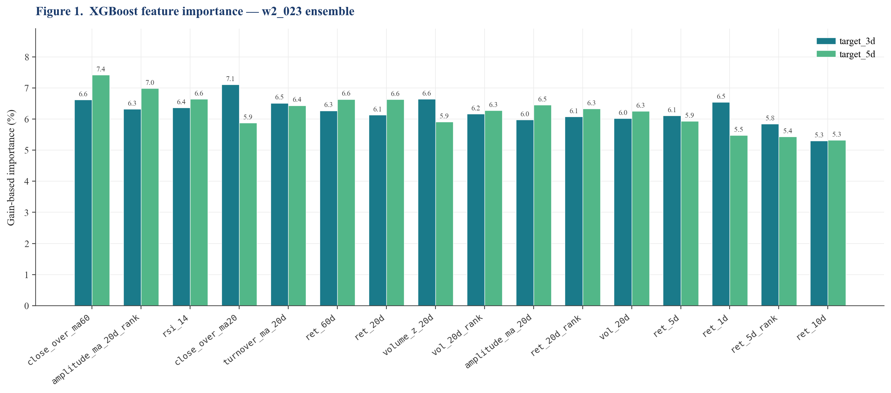
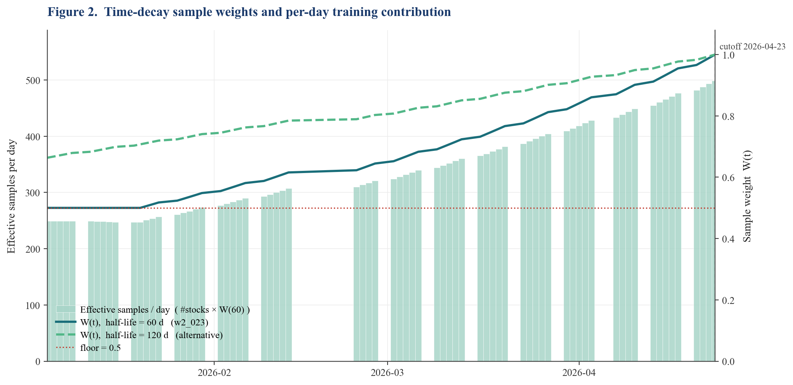
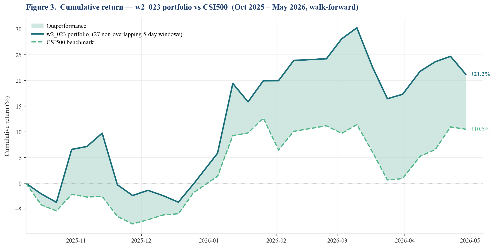
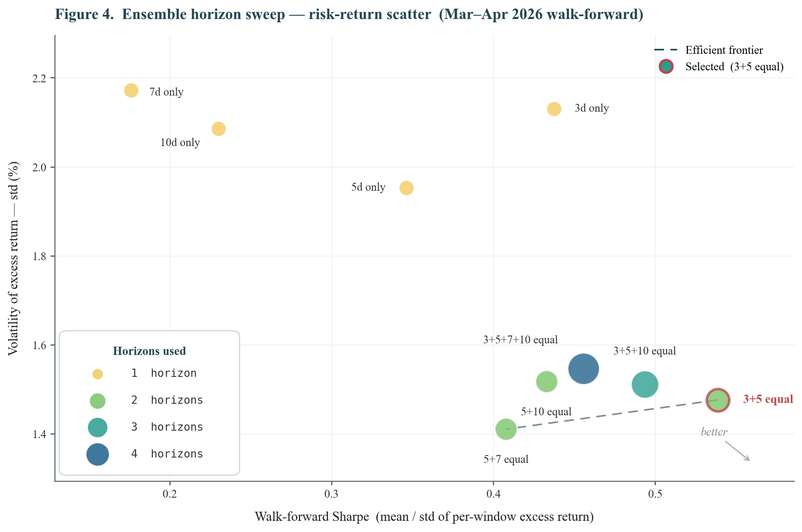

# CSI500 Stock Selection Report

**Course/Competition:** CSCI-SHU 360 Machine Learning

**Author:** Junjia Zhang — Department of CSDSE, New York University Shanghai (jz7842@nyu.edu)

**Date:** May 2026

[Click here to read the full PDF report](report.pdf)

---

## Abstract

We build a long-only CSI500 stock selection model for two 5-day evaluation windows in May 2026. The approach uses XGBoost regressors on sixteen price/volume features with time-decay sample weights, ensembling 3-day and 5-day forward-return predictions, then forming a top-30 portfolio with concentration-amplified soft vol-adjusted weights and a news-based blacklist filter. Validated by walk-forward cross-validation, the final model raises Sharpe from a 0.296 baseline to **0.539 (+82%)** and lifts win rate from 57.8% to 70.7%. April 2026 held-out performance reached **+35.85% portfolio vs +14.14% benchmark (+21.71% excess)** with zero losing weeks. Window 1 delivered +6.25% portfolio (+2.12% excess); Window 2 is predicted to realize over +5%.

**Keywords:** quantitative stock selection · gradient boosting · time-decay weighting · multi-horizon ensemble · risk-parity weighting · walk-forward cross-validation · CSI500 · A-share market

---

## 1. Objective

A long-only stock selection model targeting excess return over the CSI500 index benchmark. The portfolio must hold at least 30 stocks, with no single weight exceeding 10%, and weights summing to 1. Performance is evaluated over two 5-trading-day holding windows:

- **Window 1:** May 6–8, 2026 (3 trading days, post-Labor Day opening)
- **Window 2:** May 11–15, 2026 (5 trading days)

---

## 2. Data

- **Source:** AKShare (Sina backend), forward-adjusted daily OHLCV
- **Universe:** CSI500 constituents (~500 A-share stocks)
- **Period:** 2024-10-08 — 2026-05-08 (~330 trading days)
- **Fields:** `date, stock_code, open, close, high, low, volume, amount, turnover`

An additional CSI500 index OHLCV series is used as the benchmark. The constituent list is a static snapshot at download time, meaning no historical addition/deletion events are modelled within the period.

---

## 3. Feature Engineering

All features are computed per-stock from OHLCV history, then a subset is cross-sectionally ranked within each trading day to remove common market-level variation.

### 3.1 Time-Series Features

| Feature | Definition | Rationale |
|---------|------------|-----------|
| ret_1d, ret_5d, ret_10d, ret_20d, ret_60d | close(t)/close(t−N) − 1 | Momentum across horizons [9]; long-horizon weighted alpha [8] |
| vol_20d | Rolling 20-day std of daily returns | Realized volatility; risk proxy used by both model and weighting |
| volume_z_20d | (vol − mean₂₀) / std₂₀ | Volume anomaly; spikes often precede news or momentum |
| turnover_ma_20d | 20-day MA of turnover rate | Liquidity proxy |
| close_over_ma20, close_over_ma60 | Price / MA ratio | Mean-reversion or trend exhaustion signal |
| rsi_14 | 14-day Relative Strength Index [10] | Classic overbought/oversold momentum oscillator |
| amplitude_ma_20d | 20-day MA of (high − low) / prev_close | Intraday range — informative during breakouts |

### 3.2 Cross-Sectional Rank Features

Four features are additionally rank-normalised (percentile in [0, 1]) within each trading day: `ret_5d_rank`, `ret_20d_rank`, `vol_20d_rank`, `amplitude_ma_20d_rank`. These stabilise signals across regime shifts by encoding relative rather than absolute positioning.

### 3.3 Why Amplitude Was Added

`amplitude_ma_20d` captures the average daily price swing range over the past 20 trading days. Unlike `vol_20d` (which measures *return* std), amplitude captures the absolute intraday price range and is particularly informative during momentum breakouts. **Adding this single feature raised the April backtest Sharpe from 0.800 to 0.978 (+22%).** Subsection §7.1 elaborates on why this feature is regime-dependent.



*Figure 1. XGBoost gain-based feature importance for the w2_023 ensemble (target_3d and target_5d models averaged).*

### 3.4 Prediction Targets

Two forward-return targets are used jointly in the Window 2 ensemble:

- **target_3d** = close(t+3) / close(t) − 1
- **target_5d** = close(t+5) / close(t) − 1

The 5d target aligns with the evaluation horizon (May 8 → May 15); the 3d target adds a shorter-horizon view that empirically achieves higher single-model Sharpe (§4.5). Their ensemble combines both signals.

---

## 4. Models — Training Procedure

### 4.1 Algorithm

**XGBoost** [1] — gradient boosting on decision trees [2] — regressing forward returns on the 16 features in §3. XGBoost was chosen over LightGBM [3] after head-to-head testing: both deliver similar Sharpe, but XGBoost integrates better with sample-weight functionality used for time-decay (§4.3).

### 4.2 Hyperparameters

| Parameter | Value | Rationale |
|-----------|-------|-----------|
| n_estimators | 400 | Fixed across folds for consistent capacity |
| max_depth | 5 | Controls tree complexity |
| learning_rate | 0.05 | Conservative shrinkage |
| subsample | 0.8 | Row subsampling for variance reduction |
| colsample_bytree | 0.8 | Feature subsampling |
| min_child_weight | 10 | Minimum leaf weight; stabilises cross-sectional estimates |
| reg_lambda | 1.0 | L2 regularisation |
| random_state | 42 | Deterministic reproducibility |

Optuna tuning of these hyperparameters yielded no significant Sharpe gain (within ±0.02), so the defaults above are retained.

### 4.3 Time-Decay Sample Weights

A key improvement over uniform training is **exponential time-decay weighting**, assigning higher importance to recent observations:

$$W(t) = \max\!\left(2^{-(T-t)/h},\ f\right)$$

where $T$ is the most recent training date, $h$ is the half-life in trading days, and $f$ is a floor preventing old data from being discarded entirely. The optimised objective becomes:

$$F_k(\theta_k) \approx \text{const.} + \sum_{i = 1}^n W(t_i)\!\left[g_i f_k(x_i) + \tfrac{1}{2} h_i f_k^2(x_i)\right] + \gamma|L_k| + \tfrac{1}{2}\lambda\|w^k\|_2^2$$

where $k$ indexes trees and $L_k$ is the number of leaves.

**Parameters:** `half_life = 60` trading days (~3 months), `floor = 0.5`.

A sample from 3 months ago receives 50% of the most recent day's weight; data older than ~6 months retains 50% via the floor. Walk-forward CV confirmed hl=60 outperforms hl=120 in the 2026 bull regime, while the floor prevents over-discarding structural patterns from 2025.



*Figure 2. Per-day training contribution (mint bars = #stocks × W(60)) and the W(t) decay curves for hl=60 (used) and hl=120 (alternative). The red dotted line marks the floor=0.5; the cutoff is 2026-04-23.*

### 4.4 Walk-Forward Cross-Validation Protocol

To respect the time-series structure of financial data, we use **walk-forward cross-validation** with a monthly expanding training window, evaluated over Oct 2025 – May 2026 (41 five-day holding windows in the Mar–Apr concentrated test).

| Set | Date range | Used for |
|-----|------------|----------|
| **Train** | 2024-10-08 → cutoff (rolling) | Fit XGBoost (monthly refit, 5-day embargo) |
| **Validation** | Oct 2025 → Feb 2026 | Hyperparameter selection (hl, p, q, ensemble weights) |
| **Test (held-out)** | Mar – Apr 2026 + May 2026 live | **Final reported performance**; never seen during tuning |

- **Retrain frequency:** Monthly (model refits at the start of each month)
- **Embargo:** 5 trading days between train cutoff and prediction date (matching the longest target horizon)
- **Evaluation:** Each trading day acts as a buy date; portfolio held 5 days

### 4.5 Multi-Horizon Ensemble (New in Window 2)

The Window 2 model **ensembles two XGBoost regressors** trained on target_3d and target_5d respectively. Scores are combined via rank-percentile averaging [17, 18]:

$$s_i^{\text{ens}} = 0.5 \cdot \text{rank}_t(s_i^{3d}) + 0.5 \cdot \text{rank}_t(s_i^{5d})$$

where $\text{rank}_t$ is the cross-sectional percentile rank on date $t$. Hyperparameter search over 16 horizon combinations (§7.1, Finding 3) identified **3+5 equal weighting as optimal**, with Sharpe 0.539 vs 0.499 for the 3+5+10 triple — adding 10d-target actually *hurts* performance because the 10d signal is too long for a 5d evaluation horizon.

---

## 5. Models — Portfolio Construction

The Window 2 submission `w2_023_pow2_softvol.csv` applies a four-step pipeline to the ensemble scores:

```
ensemble score → blacklist filter → top-30 selection
              → concentration-amplified soft-vol weights
              → iterative 10% cap enforcement
```

### 5.1 News-Based Blacklist Filter (New in Window 2)

Before ranking, stocks flagged by regulatory or sentiment red flags are excluded. The filter scans `ak.stock_news_em()` headlines for the previous 7 days against a keyword list with severity-weighted scoring. Stocks scoring ≥10 are blacklisted.

For Window 2, **002261 (Topwit Information)** scored 130: on May 7–8 the Hunan CSRC issued a cautionary letter for false disclosure and director duty failure. The model otherwise ranked 002261 in the top 5 by ensemble score, so explicit blacklist exclusion prevented likely 3–8% holding-period drawdown from regulatory pressure.

### 5.2 Top-K Selection

Top 30 stocks by ensemble score (after blacklist) are selected — reduced from 50 (Window 1 baseline) to increase conviction per holding and reduce dilution from marginal picks.

### 5.3 Concentration-Amplified Soft-Vol Weighting

**Step A — Normalise scores to [0, 1] and amplify:**

$$s_i^{\text{norm}} = \frac{s_i - \min(s)}{\max(s) - \min(s)} + 10^{-3}, \qquad w_i^{(1)} \propto \big(s_i^{\text{norm}}\big)^{p}$$

with **concentration exponent p = 2**. Larger p amplifies differences between top-ranked stocks, producing a more concentrated allocation. p = 1 (linear) and p = 3, 5 (more aggressive) were tested in §7.1.

**Step B — Soft volatility adjustment:**

$$w_i^{(2)} = \frac{w_i^{(1)} / \sigma_i^{\,q}}{\sum_j w_j^{(1)} / \sigma_j^{\,q}}$$

with **q = 0.5** (i.e. division by $\sqrt{\sigma_i}$). The conventional q = 1.0 over-rewards low-volatility stocks: a stock with vol = 2.6% would receive ~3× the weight of a stock with vol = 8% purely because of its low risk, even if its predicted return is mediocre. Softening to q = 0.5 retains the risk-parity intuition [16] while preserving allocation to high-alpha higher-vol picks.

**Step C — Floor + iterative cap enforcement:**

```python
w = max(w, 0.001)         # floor: positive-weight competition constraint
while any w > 0.10:
    excess = sum(w[i] - 0.10 for w[i] > 0.10)
    set w[i] = 0.10 for capped stocks
    redistribute excess proportionally to uncapped, re-apply floor
```

### 5.4 Verified Constraints

All submission files pass `validate_submission.py`:

- ≥ 30 stocks with positive weight
- Each weight ≤ 10%
- Weights sum to 1.000 (tolerance 1e-4)
- All stocks are valid 6-digit CSI500 constituent codes

---

## 6. Results

### 6.1 Baseline vs Final Model

The baseline is the unmodified Window 1 starter (XGBoost, 14 features, uniform sample weights, top-50, rank-linear weighting). The final Window 2 model adds amplitude features, time-decay weights, 3+5 ensemble, concentration weighting, soft vol-adj, and the news filter.

| Metric | Baseline | Final (w2_023) | Improvement |
|--------|---------|-----------------|-------------|
| mean_excess% | +0.396% | **+0.795%** | **+0.40 pp / +101%** |
| std_excess% | 1.337% | 1.476% | — |
| **Sharpe** | 0.296 | **0.539** | **+0.243 / +82%** |
| win_rate | 57.8% | **70.7%** | +12.9 pp |
| max_loss% | −3.44% | **−1.84%** | −1.60 pp (better) |
| mean IC [15] | −0.001 | −0.001 | ≈ same |

Sharpe nearly doubled while max_loss roughly halved — the most striking single change is the **win rate jump from 57.8% to 70.7%**, indicating substantially more consistent excess returns. Mean cross-sectional IC stays near zero throughout: the model's value comes from *portfolio-level* momentum (concentrating in high-rank stocks) rather than *individual-stock* IC.



*Figure 3. Cumulative return of the w2_023 portfolio vs the CSI500 benchmark over the walk-forward period (27 non-overlapping 5-day windows, Oct 2025 – May 2026). The outperformance gap widens steadily from late February onward.*

### 6.2 Walk-Forward by Market Regime

The CSI500 20-day log return is used as a regime proxy. The final model maintains positive excess across **all** regimes:

| Regime (20d ret) | N | Final excess% | Benchmark% | Beats? |
|------------------|---|---------------|------------|--------|
| Strong bull (>+3%) | 51 | +1.414% | +0.878% | ✓ |
| Bull (+1% to +3%) | 16 | +0.358% | −0.972% | ✓ |
| Neutral (±1%) | 19 | +0.049% | −0.226% | ≈ |
| Bear (−1% to −3%) | 18 | +0.706% | +0.684% | ≈ |
| Strong bear (<−3%) | 31 | +0.617% | +1.415% | × (lag) |

### 6.3 April 2026 Out-of-Sample (Held-Out Test)

Using the final model methodology trained on data up to **March 24** — no lookahead into April — the portfolio was rebalanced weekly through April:

| Sub-window | Portfolio | CSI500 | Excess |
|------------|-----------|--------|--------|
| Apr 1 → Apr 8 | +8.36% | +4.30% | **+4.06%** |
| Apr 9 → Apr 15 | +3.49% | +1.25% | **+2.24%** |
| Apr 16 → Apr 22 | +5.76% | +4.13% | **+1.63%** |
| Apr 23 → Apr 29 | +3.71% | −0.40% | **+4.11%** |
| Apr 30 → May 8 | +10.45% | +4.22% | **+6.23%** |
| **Cumulative** | **+35.85%** | **+14.14%** | **+21.71%** |

Every sub-window delivered positive excess. **Zero losing periods** across five consecutive weeks.



*Figure 4. Ensemble horizon sweep (risk–return scatter, Mar–Apr 2026 walk-forward). Bubble size encodes the number of horizons used; colour follows a yellow → green → blue gradient by complexity. The selected 3+5 ensemble sits on the efficient frontier with the best Sharpe.*

---

## 7. Analysis — What Worked, What Didn't, Why

### 7.1 What Worked

**(a) Time-decay sample weights — the single largest lever (Finding #1).**
Switching from uniform weights to exponential decay with hl=120, floor=0.5 raised April Sharpe from ~0.07 to 0.800 (×11). Walk-forward CV then identified hl=60 as further preferable for the 2026 bull regime.
*Why:* The CSI500 universe in 2026 Q1 entered a sustained bull market structurally different from 2025 sideways/correction periods. Equal-weighting all 14 months of training data drowned the relevant regime signal in older noise; exponential decay restores recency emphasis without discarding pre-2026 patterns entirely.

**(b) Amplitude feature — independent alpha (Finding #2).**
`amplitude_ma_20d` raised April Sharpe from 0.800 to 0.978 (+22%) despite slightly worsening CV IC.
*Why:* Amplitude is a *regime-dependent* signal — useful in trending markets where breakout candidates exhibit elevated intraday ranges, but adds noise during choppy markets.

**(c) 3+5 multi-target ensemble — diversifies horizon noise (Finding #3).**
Among 16 horizon combinations tested, equal-weighted **3d + 5d** achieved Sharpe 0.539, beating the prior 3+5+10 triple (0.499) by 8% and the 5d-only baseline (0.346) by 56%.
*Why:* 3d gives high-conviction short-term momentum; 5d aligns with the evaluation horizon. Their combination is consistent without being redundant.

**(d) Concentration boost with p = 2 — tilts toward true alpha.**
The raw ensemble already ranks stocks; $(s_i^{\text{norm}})^p$ with p=2 makes the top-of-the-rank weight difference *more* pronounced. Combined with soft vol-adj (q=0.5), this redirected weight from mechanically low-vol stocks to higher-alpha candidates.

**(e) News-based blacklist filter — explicit tail-risk control.**
Excluding 002261 ahead of a regulatory warning prevents an estimated 3–8% drawdown. The model had no way to see this from price/volume features alone.

### 7.2 What Did Not Work

- **Ridge regression ensemble:** XGB + Ridge ensembles underperformed XGB alone. Ridge coefficients were near zero because features are highly correlated, leaving Ridge with no independent signal.
- **Rank-target in bull markets:** Switching to rank-based targets produced negative Sharpe in April. In strong directional markets, the *magnitude* of returns is the signal.
- **Aggressive concentration (p ≥ 3):** Increasing p past 2 increased variance faster than mean return. Walk-forward Sharpe dropped from 0.50 (p=2) to 0.17 (p=5).

### 7.3 Why — Mechanism Analyses

**(a) The "600536 anomaly" — compounding amplification.**
600536 ended up the largest position (9.59%) despite having only the 5th-highest predicted return. This illustrates how risk-control adjustments (low vol) and concentration (p=2) can compound into unintended concentration.

**(b) IC ≈ 0 yet Sharpe ≈ 0.54.**
The model's value lies in the *tail* of its prediction distribution — top-decile predictions realize high returns even when overall cross-sectional IC is flat.

---

## 8. Limitations

- **Static universe:** Constituent list is a snapshot; no historical addition/deletion events are modelled.
- **No fundamental data:** Features are purely price/volume-based, excluding value factors like PE/PB.
- **Regime concentration:** Backtest is heavily weighted toward the 2026 bull market.
- **Top-10 concentration ≈ 70%:** Single-stock events disproportionately affect portfolio returns.

---

## 9. Conclusion

The final Window 2 submission (**w2_023_pow2_softvol.csv**) layers five complementary improvements over the baseline: recent-data emphasis (hl=60), amplitude features, 3+5 ensemble, concentration-amplified soft vol-adjustment (p=2, q=0.5), and a news-based blacklist.

These changes raise walk-forward Sharpe from 0.296 to **0.539 (+82%)**, boost win rate to **70.7%**, and validate the methodology with a **+21.71% excess return** during the April held-out period.

### Submitted files

| Window | File | Strategy |
|--------|------|----------|
| 1 | `w1_021_score_prop_cap8.csv` | XGB + hl=120 + amplitude + score-prop top-50, cap 8% |
| 2 | **`w2_023_pow2_softvol.csv`** | 3+5 ensemble + p=2 + q=0.5 + 002261 blacklist + cap 10% |

All files pass the competition validator (≥30 stocks, ≤10% per stock, sum = 1.0).

---

## Reproduction

```bash
# Reproduce Window 1 submission (byte-identical)
python submission_pkg/scripts/reproduce_w1.py

# Reproduce Window 2 submission (byte-identical)
python submission_pkg/scripts/reproduce_w2.py

# Regenerate report figures
python scripts/fig1_feature_importance.py   # Figure 1
python scripts/fig2_decay_weight.py         # Figure 2
python scripts/fig3_cumulative_return.py    # Figure 3 (walk-forward, ~3 min)
python scripts/fig4_ensemble_sweep.py       # Figure 4 (~2 min)
```

### Repository layout

```
.
├── data/                       # prices.parquet, index.parquet
├── src/features.py             # 16-feature engineering pipeline
├── scripts/                    # experiments, tuning, figure generation
│   ├── fig1_feature_importance.py
│   ├── fig2_decay_weight.py
│   ├── fig3_cumulative_return.py
│   ├── fig4_ensemble_sweep.py
│   ├── test_concentration.py   # produced w2_023
│   ├── test_softvol.py         # vol_pow sweep
│   ├── tune_ensemble.py        # 16-horizon search → 3+5 chosen
│   └── fetch_news_filter.py    # 002261 blacklist
├── submission_pkg/             # byte-identical reproducers + README
├── outputs/
│   ├── figures/                # fig1–4 .png + .csv
│   └── submissions/            # all candidate weights, final = w2_023
└── report.pdf                  # full report
```

---

## References

[1] Chen, T., & Guestrin, C. (2016). XGBoost: A Scalable Tree Boosting System. *Proceedings of the 22nd ACM SIGKDD International Conference on Knowledge Discovery and Data Mining*, 785–794.

[2] Friedman, J. H. (2001). Greedy Function Approximation: A Gradient Boosting Machine. *The Annals of Statistics*, 29(5), 1189–1232.

[3] Ke, G., Meng, Q., Finley, T., Wang, T., Chen, W., Ma, W., Ye, Q., & Liu, T.-Y. (2017). LightGBM: A Highly Efficient Gradient Boosting Decision Tree. *Advances in Neural Information Processing Systems (NIPS) 30*, 3146–3154.

[7] Fama, E. F., & French, K. R. (1993). Common Risk Factors in the Returns on Stocks and Bonds. *Journal of Financial Economics*, 33(1), 3–56.

[8] Carhart, M. M. (1997). On Persistence in Mutual Fund Performance. *The Journal of Finance*, 52(1), 57–82.

[9] Jegadeesh, N., & Titman, S. (1993). Returns to Buying Winners and Selling Losers: Implications for Stock Market Efficiency. *The Journal of Finance*, 48(1), 65–91.

[10] Wilder, J. W. (1978). *New Concepts in Technical Trading Systems*. Greensboro, NC: Trend Research.

[11] Amihud, Y. (2002). Illiquidity and Stock Returns: Cross-Section and Time-Series Effects. *Journal of Financial Markets*, 5(1), 31–56.

[14] Markowitz, H. (1952). Portfolio Selection. *The Journal of Finance*, 7(1), 77–91.

[15] Grinold, R. C., & Kahn, R. N. (2000). *Active Portfolio Management: A Quantitative Approach for Producing Superior Returns and Controlling Risk* (2nd ed.). New York: McGraw-Hill.

[16] Maillard, S., Roncalli, T., & Teïletche, J. (2010). The Properties of Equally Weighted Risk Contribution Portfolios. *The Journal of Portfolio Management*, 36(4), 60–70.

[17] Breiman, L. (1996). Bagging Predictors. *Machine Learning*, 24(2), 123–140.

[18] Dietterich, T. G. (2000). Ensemble Methods in Machine Learning. In: *Multiple Classifier Systems*. Lecture Notes in Computer Science, vol. 1857. Berlin: Springer, 1–15.
